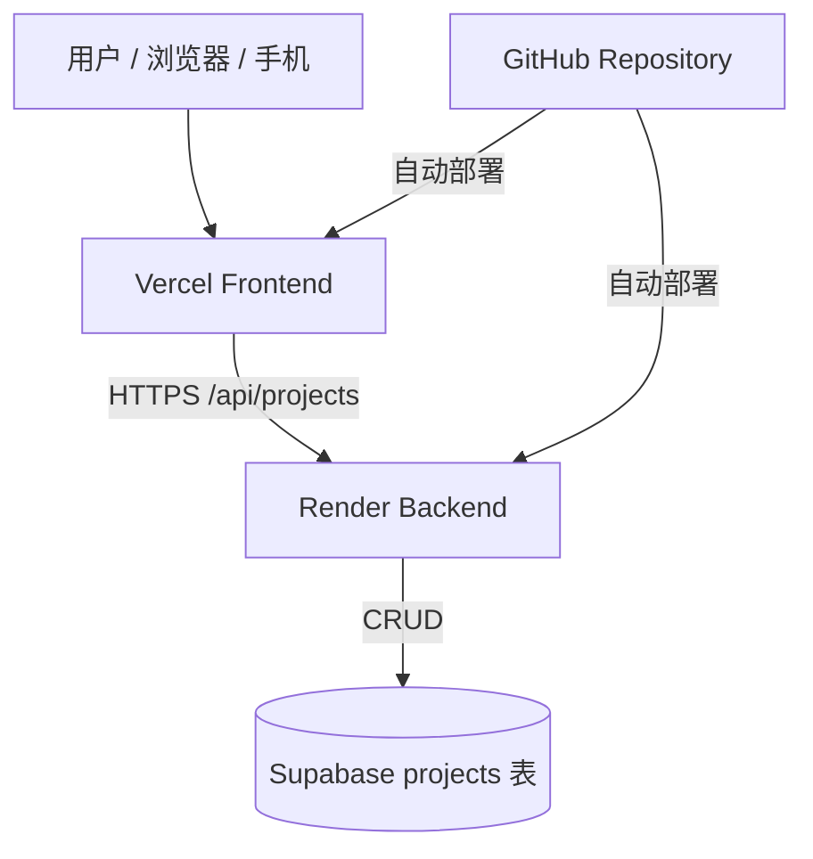
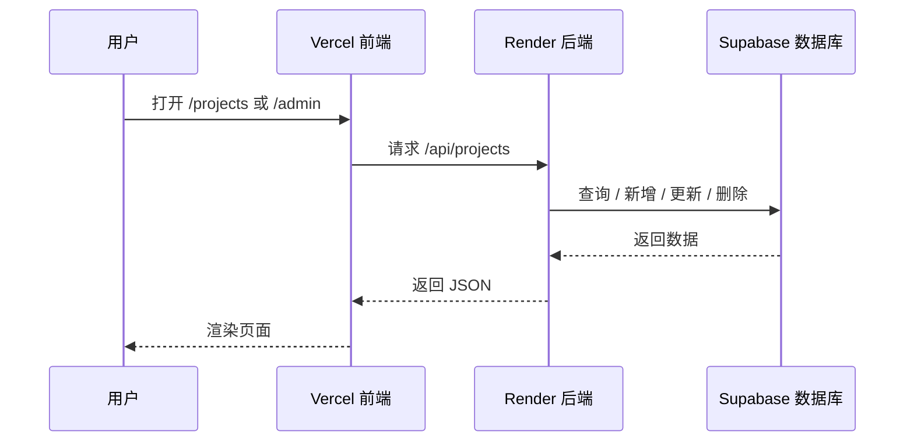

# MyBlogAboutWeb

一个已经完成线上部署的个人博客项目，展示机器人、视觉与嵌入式 AI 相关内容。

当前线上架构：

- 前端部署在 `Vercel`
- 后端部署在 `Render`
- 数据库存储在 `Supabase`

## 架构图



## 请求链路



## 项目说明

这个项目最初使用本地 `projects.json` 作为数据源，现已切换为 `Supabase` 数据库，支持线上读取、创建、编辑和删除项目内容。

页面包含：

- 首页
- 项目列表页
- 项目详情页
- 在线留言页（联系页）
- 后台登录页
- 后台管理页

## 项目结构

```text
ClaudeAboutWeb/
├── index.html
├── server.js
├── package.json
├── .env.example
├── vercel.json
├── data/
│   ├── projects.json
│   └── projects-import.csv
└── public/
    ├── index.html
    ├── welcome.html
    ├── projects.html
    ├── project-detail.html
    ├── contact.html
    └── admin.html
```

## 技术栈

- `Express`
- `Supabase`
- `Vercel`
- `Render`
- `HTML / CSS / JavaScript`

## 页面路由

- `/`：博客首页
- `/welcome`：项目欢迎页（点击"项目归档/浏览项目"先进入此过渡页，再进入项目列表）
- `/projects`：项目列表页（瀑布流卡片 + 关键词搜索 + 按关键词自动分类的标签筛选）
- `/project/:id`：项目详情页
- `/forum`：论坛页（登录用户发表文章 / 帖子并互相讨论）
- `/space`：个人空间（用户自己的写作器，保存草稿或发布到论坛）
- `/contact`：在线留言页（访客可直接给站长发消息）
- `/admin`：后台管理页
- `/admin-login`：后台登录页

`Vercel` 通过 [`vercel.json`](C:/Users/86151/Desktop/ClaudeCode/ClaudeAboutWeb/vercel.json) 将这些路由重写到静态页面：

- `/projects` -> `/projects.html`
- `/forum` -> `/forum.html`
- `/space` -> `/space.html`
- `/admin` -> `/admin.html`
- `/project/:id` -> `/project-detail.html?id=:id`

## API 端点

后端由 `Render` 托管，接口包括：

| 方法       | 路径                  | 功能             |
| ---------- | --------------------- | ---------------- |
| `GET`    | `/api/projects`     | 获取项目列表     |
| `GET`    | `/api/projects/:id` | 获取单个项目详情 |
| `POST`   | `/api/projects`     | 新建项目         |
| `PUT`    | `/api/projects/:id` | 更新项目         |
| `DELETE` | `/api/projects/:id` | 删除项目         |
| `POST`   | `/api/uploads/image` | 上传封面/正文图片（需登录），返回公开链接 |
| `POST`   | `/api/uploads/video` | 上传演示视频（需登录），返回公开链接 |
| `POST`   | `/api/uploads/document` | 导入 MD/Word/PDF（需登录），解析为正文 HTML 并返回目录/摘要/标题 |
| `POST`   | `/api/contact`      | 提交留言并邮件通知站长 |

## 在线留言（联系页）

访客在 `/contact` 页面填写称呼、邮箱（选填）和留言内容后，前端会调用 `POST /api/contact`，后端把留言邮件发送到 `CONTACT_TO`（默认 `2284610019@qq.com`）。

发信方式支持两种，**优先使用 Resend**：

| 方式 | 触发条件 | 说明 |
| --- | --- | --- |
| **Brevo HTTP API（最推荐）** | 配置了 `BREVO_API_KEY` | 走 HTTPS；**验证单个发件邮箱即可给任意收件人发信，无需自有域名**，免费 300 封/天 |
| Resend HTTP API | 未配 Brevo，配了 `RESEND_API_KEY` | 走 HTTPS；免费版**没验证域名时只能发到你自己账号邮箱** |
| SMTP（备选） | 都没配，但配了 `SMTP_USER`/`SMTP_PASS` | Render **免费实例已封禁出站 SMTP 端口**，需付费实例才可用 |

> **想给任意访客发信（如留言回执、注册验证码）又不想买域名** → 用 **Brevo**：在 [brevo.com](https://www.brevo.com) 注册 → 验证一个发件邮箱（如你的 QQ 邮箱）→ 创建 API Key 填 `BREVO_API_KEY`，并把 `BREVO_SENDER` 设为该验证过的邮箱。优先级：Brevo > Resend > SMTP。

> ⚠️ **重要**：Render 自 2025-09-26 起，免费 Web 服务封禁了出站 SMTP 端口（25/465/587），所以免费实例上 SMTP 一定连接超时。免费方案请用 Resend。

### 用 Resend（免费）

1. 到 [resend.com](https://resend.com) 注册（建议直接用你的收件 QQ 邮箱注册）
2. 创建一个 **API Key**
3. 在 Render 后端服务的环境变量里加：
   ```env
   RESEND_API_KEY=re_xxxxxxxx
   RESEND_FROM=MyBlog <onboarding@resend.dev>
   ```
4. 重新部署即可。没有自有域名时用默认的 `onboarding@resend.dev` 发信，**只能发到你 Resend 账号的邮箱**——而本场景的收件人正是站长本人，所以够用。若以后要发给任意地址，在 Resend 验证一个自有域名再把 `RESEND_FROM` 换成该域名地址即可。

### 其它行为

- 收件箱：由 `CONTACT_TO` 控制，默认 `2284610019@qq.com`
- 频率限制：同一 IP 每小时最多发送 5 条（仅统计**成功**发送）
- 访客填了邮箱时，邮件带 `Reply-To`，方便直接回复
- 两种方式都没配时接口返回 503，前端自动降级为 `mailto:` 链接，访客仍可一键用邮件联系；发送失败返回 502，同样有 `mailto:` 兜底

## 访客访问门禁（注册 / 登录后才能看项目）

`/welcome` 是访问项目前的门禁页：访客需**注册**（邮箱 + 自设密码；邮箱须先经管理员审批放行）或**登录**（邮箱 + 密码）后，才能浏览项目。**硬门槛**：未登录时 `GET /api/projects`、`GET /api/projects/:id` 返回 401，前端会自动跳转到 `/welcome`（管理员 token 也放行，便于自己浏览）。

> **注册采用「邮件申请 + 后台审批」**：访客用想注册的邮箱发邮件向管理员申请 → 管理员在后台「会员管理 / 注册审批」放行该邮箱（「仅放行注册」建普通账号，或「添加为会员」同时开通会员）→ 本人用同一邮箱在 `/welcome` 设置密码完成注册。这样无需配置发信域名 / 验证码邮件。仅允许 Gmail / Outlook / QQ / 163 邮箱。

### 流程与接口

| 方法 | 路径 | 说明 |
| --- | --- | --- |
| `GET` | `/api/access/config` | 返回 Turnstile site key（若配置）、内置人机验证的一次性表单令牌、申请用的联系邮箱 |
| `POST` | `/api/access/register` | 注册：邮箱须**已被管理员审批放行**（存在空密码占位账号），人机验证 + 限流后设置**用户名 + 密码**并发放访问令牌；未放行返回 403 并提示发邮件申请 |
| `POST` | `/api/access/login` | 邮箱 + 密码登录，发放访问令牌 |
| `GET` | `/api/access/verify` | 校验访问令牌是否有效（`X-Access-Token`），返回邮箱、用户名与会员状态 |
| `POST` | `/api/access/username` | 给登录后但尚未设置用户名的老账号补设用户名（一次性、唯一） |
| `POST` | `/api/admin/visitors` | 后台审批放行一个邮箱（建「待认领」普通账号，仅管理员） |

> **用户名 = 站内唯一身份**：注册时除邮箱、密码外还需设置**用户名**（2~20 位中文 / 字母 / 数字 / 下划线 / 连字符，全站唯一，作为论坛里的公开身份）。管理员手动开通 / 老账号在数据库里没有用户名时，本人登录后可在论坛页或调用 `POST /api/access/username` 补设一次。

访问令牌为 HMAC 签名、含 14 天有效期，存在访客浏览器的 `localStorage`，请求项目时通过 `X-Access-Token` 头携带。密码用 `scrypt` + 随机盐哈希存储在 Supabase `visitors` 表。

### 安全防护（防号池 / 机器人）

- **审批门槛**：注册采用「邮件申请 + 后台审批」——只有管理员在后台放行（预建空密码占位账号）的邮箱才能设置密码完成注册，未放行的邮箱注册返回 403。
- **邮箱白名单**：仅允许 Gmail / Outlook / QQ / 163 邮箱注册（前端校验 + 后端审批接口与注册接口均校验）。
- **人机验证**：优先 Cloudflare Turnstile（配 `TURNSTILE_SITE_KEY` / `TURNSTILE_SECRET_KEY`）；未配置时用内置方案——**蜜罐字段** + **签名表单令牌**（含时间陷阱：提交过快判为机器人、一次性防重放）。
- **限流**：注册按 **每 IP** 限流；登录失败按 **IP/邮箱** 限流。密码哈希用 scrypt。

### 会员（订阅制）与 AI 助手

- **会员**：访客账号带 `member_until`（到期时间），在未来即为有效会员；**按月订阅**。后台「会员管理」面板可对每个用户「+1 个月」（授予/续费）、「取消会员」（仅去资格、保留账号）或「删除」（彻底移除账号）。
- **管理员 = 顶级会员**：管理员账号本身拥有全部会员权限（看私有源码、用 AI 助手），无需给自己开通会员。**管理员登录令牌长期有效、不过期**（如需作废全部管理员令牌，更换 `ADMIN_SESSION_SECRET` 即可）。
- **审批放行 / 手动添加会员**：后台「会员管理 / 注册审批」面板输入邮箱后，「仅放行注册」建普通账号（允许其注册、不含会员权益），「添加为会员」则同时开通会员。若该邮箱**尚未注册**，都会先建立一个「待认领」账号（空密码占位）；本人之后用该邮箱设置密码即可登录，已授予的会员有效期保留。
- **会员特权**：
  - **站内只读浏览私有仓库源码**：详情页「浏览源码（站内只读）」打开站内文件浏览器，后端用服务端 `GITHUB_TOKEN` 拉取私有仓库的文件树与文件内容（`GET /api/projects/:id/repo/tree`、`/repo/file`，均需会员）。访客**不接触 GitHub、拿不到任何 GitHub 凭证，因此无法 `git clone`**；非会员看到「🔒 仅会员可见」，后端把 `repoUrl` 置空不泄露。
    - 说明：GitHub 没有「能看不能 clone」的协作者权限，所以采用站内只读浏览而非把人加进仓库。`GITHUB_TOKEN` 需对相关私有仓库有 Contents 读权限。
  - 使用**悬浮 AI 助手**（右下角 🤖）：`POST /api/assistant/chat`，仅会员/管理员可用，代理到 OpenAI 兼容接口（`LLM_API_KEY` / `LLM_BASE_URL` / `LLM_MODEL`，支持 OpenAI / DeepSeek / Kimi / 智谱 等），带每账号每小时限流。
- 后台接口：`GET /api/admin/visitors`（列出用户）、`PATCH /api/admin/visitors/:email`（`{extendMonths}` 授予/续费、邮箱不存在时自动建「待认领」账号 / `{revoke:true}` 取消资格）、`DELETE /api/admin/visitors/:email`（删除账号）。

#### 支付与开通（人工收款 + 一键开通）

当前为**人工收款 + 一键开通**的订阅模式（个人微信/支付宝收款码无到账回调，无法纯自动；价格默认 50 元/月，在 `public/welcome.html` 的 `PLANS` 改）：

1. 用户登录后在 `/welcome` 扫收款码付款 → 点「我已付款」。
2. 后端给管理员邮箱（`CONTACT_TO`）发通知邮件，内含一个**一键开通**链接。
3. 管理员核对手机确实到账后，点链接 → 打开确认页 → 选 1/3/12 个月 → 即开通（自动写库）。

一键开通链接安全性：HMAC 签名（不可伪造）+ 7 天有效期 + 一次性（防重放）+ 仅发到管理员私人邮箱；令牌只授权「对该邮箱开通」，月数由管理员在确认页选。GET 仅展示确认页、不产生副作用（防邮件预取误触发），实际开通走 POST。相关接口：`GET/POST /api/admin/grant`（凭签名令牌授权，无需登录后台）。
> 提示：一次性状态存内存，Render 免费实例休眠重启后会重置，理论上 7 天内同一链接可能被再次使用——但链接只在你私人邮箱，风险可忽略。若要更严格可接官方商户支付（微信/支付宝商户、Stripe）实现全自动回调。

### 前置条件 ⚠️

1. 建表（见 [`data/migration-add-visitors.sql`](data/migration-add-visitors.sql)）：
   ```sql
   create table if not exists visitors (
     email text primary key,
     password_hash text not null,
     member_until timestamptz,
     created_at timestamptz default now()
   );
   ```
2. **邮件能发到任意访客邮箱**：注册验证码要发到访客自己的邮箱。**最简单的方式是用 Brevo**（见上文「在线留言」一节）——验证一个发件邮箱（如你的 QQ 邮箱）即可给任意人发信，无需域名。（若用 Resend 则需验证自有域名，否则只能发到你自己账号邮箱。）

## 论坛（讨论 / 发表文章）

`/forum` 是面向**有账号用户**的交流空间：登录后可**发表文章 / 帖子**，并在帖子下**互相回复讨论**。每个用户以注册时设置的**用户名**作为公开身份（全站唯一）。未登录访问会自动跳转到 `/welcome`；管理员令牌同样放行（以站长身份参与）。

### 接口

| 方法 | 路径 | 说明 |
| --- | --- | --- |
| `GET` | `/api/forum/posts` | 帖子列表（倒序、含每帖回复数）；需登录 |
| `GET` | `/api/forum/posts/:id` | 帖子详情 + 全部回复（草稿仅作者/管理员可见）；需登录 |
| `POST` | `/api/forum/posts` | 新建帖子（`{title, content, status}`，status=draft/published）；需登录且已设置用户名 |
| `PUT` | `/api/forum/posts/:id` | 编辑自己的帖子（标题 / 正文 / 发布状态）；作者本人或管理员 |
| `POST` | `/api/forum/posts/:id/replies` | 回复某帖（`{content}`）；需登录且已设置用户名 |
| `POST` | `/api/forum/posts/:id/like` | 点赞 / 取消点赞（切换）；需登录 |
| `DELETE` | `/api/forum/posts/:id` | 删除帖子（作者本人或管理员；回复随之级联删除） |
| `DELETE` | `/api/forum/replies/:id` | 删除回复（作者本人或管理员） |

- 帖子正文支持**轻量 Markdown**（标题 / 加粗 / 斜体 / 列表 / 引用 / 代码 / 链接），由前端**安全渲染**（先整体转义、只引入受控标签、链接限定 http(s)），避免 XSS；回复按纯文本渲染。
- 发帖 / 回复 / 点赞按**每账号每小时**限流；帖子作者以 `author_username` **冗余保存**，账号被删后历史内容仍保留署名。

### 个人空间（`/space`）

每个登录用户都有自己的写作空间，复用站内写作器（Markdown + 实时预览 + 格式工具栏）：

- **写作即选择发布去向**：`保存到我的空间（草稿）` 仅自己可见；`发布到论坛` 则公开在 `/forum`。
- 「我的文章」列表可**编辑、删除、在草稿 ↔ 已发布之间一键切换**。
- **个人资料**：可设置**头像**（浏览器内压缩为 96px 方图存储）与**自我介绍**；头像 / 简介会显示在论坛的帖子与回复处。接口：`GET/POST /api/access/profile`。
- 接口：`GET /api/forum/mine`（列出自己的全部文章，含草稿）、`GET /api/forum/mine/:id`（取回可编辑原文）。
- 实现：帖子用 `status` 字段区分（`draft` / `published`）；论坛公开列表只查 `published`，草稿详情对非作者一律按「不存在」处理。

### 前置条件 ⚠️

执行 [`data/migration-add-forum.sql`](data/migration-add-forum.sql)：给 `visitors` 加唯一 `username` 列，新建 `forum_posts`、`forum_replies`、`forum_post_likes`，并给 `forum_posts` 加 `status` 列。**未执行前**：注册接口会返回「请先执行 visitors.username 迁移」，论坛/我的空间会提示需要初始化。

```sql
alter table visitors add column if not exists username text;
create unique index if not exists visitors_username_lower_idx on visitors (lower(username));
alter table forum_posts add column if not exists status text not null default 'published';
-- forum_posts / forum_replies / forum_post_likes 及索引见迁移文件
```

个人资料（头像 / 自我介绍）另需执行 [`data/migration-add-profile.sql`](data/migration-add-profile.sql)：

```sql
alter table visitors add column if not exists avatar_url text;
alter table visitors add column if not exists bio text;
```

## CORS 跨域配置

前端（Vercel）与后端（Render）不同源，后端通过环境变量 `CORS_ORIGIN` 控制允许访问的前端域名。若页面出现 `Not allowed by CORS`，说明当前访问的域名不在白名单里。

- 多个域名用英文逗号隔开，**不要带结尾斜杠**（如 `https://xxx.vercel.app/` 会匹配失败）
- 匹配**忽略大小写并自动去掉结尾斜杠**，避免常见的格式踩坑
- 支持 `*` 通配符：配一条 `https://*.vercel.app` 即可同时覆盖正式域名和所有 Vercel **预览部署**域名（预览 URL 每个分支都不同）
- `CORS_ORIGIN` 留空表示放行所有来源（仅建议本地开发使用）

示例：

```env
CORS_ORIGIN=https://your-frontend-domain.vercel.app,https://*.vercel.app
```

## Supabase 数据表

项目数据存储在 `projects` 表中，推荐结构如下：

```sql
create table projects (
  id text primary key,
  title text not null,
  date date,
  summary text,
  "coverImage" text,
  "videoUrl" text,
  "repoUrl" text,
  tags text[] default '{}',
  status text default 'published',
  pinned boolean default false,
  content text,
  created_at timestamp with time zone default now(),
  updated_at timestamp with time zone default now()
);
```

如果你的 `projects` 表是在加入视频功能之前创建的，请对线上数据库执行下面的迁移补上 `videoUrl` 列，否则项目列表、新增、编辑接口会返回 500：

```sql
alter table projects add column if not exists "videoUrl" text;
```

### GitHub 仓库链接（repoUrl）

每个项目可填一个 GitHub 仓库链接：详情页展示「在 GitHub 查看源码」按钮，列表卡片显示 GitHub 小图标。加列（见 [`data/migration-add-repo-url.sql`](data/migration-add-repo-url.sql)，未执行时同样容错忽略）：

```sql
alter table projects add column if not exists "repoUrl" text;
```

### 标签 / 分类（tags）

后台支持给每个项目打**标签**，项目归档页据此做**真实分类筛选**（没有标签的旧项目自动回退到关键词分类）。启用需要给表加 `tags` 列（见 [`data/migration-add-tags.sql`](data/migration-add-tags.sql)）：

```sql
alter table projects add column if not exists tags text[] default '{}';
```

> 后端做了**容错**：未执行该迁移时，项目仍可正常读取/创建/编辑（仅暂时忽略标签，列表回退到关键词自动分类）。执行迁移后，后台填写的标签即生效。

### 草稿状态 / 置顶（status & pinned）

后台支持把项目存为**草稿**（不在前台显示）和**置顶**（前台优先展示）。需要给表加两列（见 [`data/migration-add-status-pinned.sql`](data/migration-add-status-pinned.sql)）：

```sql
alter table projects add column if not exists status text default 'published';
alter table projects add column if not exists pinned boolean default false;
```

- 公开接口 `GET /api/projects` 只返回**已发布**项目，且**置顶优先**、再按日期倒序
- 后台接口 `GET /api/admin/projects`（需登录）返回**全部**（含草稿）
- `PATCH /api/projects/:id`（需登录）用于在后台列表快速切换置顶/草稿，无需重传全文
- 后台列表可按**状态/标签**筛选并显示徽章；项目页可切换**最新/最早**排序，置顶项目带「★ 置顶」标记
- 同样**容错**：未执行迁移时不影响现有功能（仅忽略草稿/置顶；快捷开关会提示先执行迁移）

## 本地运行

### 1. 安装依赖

```bash
npm install
```

### 2. 配置环境变量

参考 [`.env.example`](C:/Users/86151/Desktop/ClaudeCode/ClaudeAboutWeb/.env.example)：

```env
SUPABASE_URL=https://your-project-ref.supabase.co
SUPABASE_SERVICE_ROLE_KEY=your-secret-key
CORS_ORIGIN=https://your-frontend-domain.vercel.app,https://*.vercel.app
ADMIN_USERNAME=admin
ADMIN_PASSWORD=change-this-password
ADMIN_SESSION_SECRET=change-this-random-secret
PORT=3000

# 在线留言邮件发送（联系页）
CONTACT_TO=2284610019@qq.com
SMTP_HOST=smtp.qq.com
SMTP_PORT=465
SMTP_SECURE=true
SMTP_USER=your-account@qq.com
SMTP_PASS=your-smtp-authorization-code
CONTACT_FROM=your-account@qq.com
```

### 3. 启动服务

```bash
node server.js
```

浏览器访问：

```text
http://localhost:3000
```

## 部署说明

### 前端部署到 Vercel

1. 将项目推送到 GitHub
2. 在 `Vercel` 中导入仓库
3. `Application Preset` 选择 `Other`
4. 部署完成后得到前端域名

### 后端部署到 Render

1. 在 `Render` 中创建 `Web Service`
2. 连接同一个 GitHub 仓库
3. 构建命令使用：

```bash
npm install
```

4. 启动命令使用：

```bash
node server.js
```

5. 在 `Environment Variables` 中添加：

```env
SUPABASE_URL=https://your-project-ref.supabase.co
SUPABASE_SERVICE_ROLE_KEY=your-secret-key
CORS_ORIGIN=https://your-frontend-domain.vercel.app,https://*.vercel.app
ADMIN_USERNAME=admin
ADMIN_PASSWORD=change-this-password
ADMIN_SESSION_SECRET=change-this-random-secret
NODE_ENV=production
CONTACT_TO=2284610019@qq.com
SMTP_HOST=smtp.qq.com
SMTP_PORT=465
SMTP_SECURE=true
SMTP_USER=your-account@qq.com
SMTP_PASS=your-smtp-authorization-code
CONTACT_FROM=your-account@qq.com
```

### 数据库部署到 Supabase

1. 创建 `Supabase` 项目
2. 新建 `projects` 表
3. 导入项目数据
4. 在 `Render` 中配置 `SUPABASE_URL` 和 `SUPABASE_SERVICE_ROLE_KEY`

## 当前说明

- 前端已经适配线上 `Render` API 地址
- 后端已经切换到 `Supabase`
- `projects.json` 现在主要作为初始数据参考，不再是线上正式数据源
- 已实际验证后台新增、编辑、删除可以写入 `Supabase`
- 后台新增了用户名密码登录保护，未登录不能执行创建、修改、删除操作
- 后台现在支持上传本地视频文件，视频会进入 `Supabase Storage`
- 后台封面图片支持两种方式：粘贴外链，或直接上传本地图片（≤ 8MB，存入 `Supabase Storage` 的 `project-covers` 桶并自动回填链接，带预览）
- 正文编辑支持「上传图片插入正文」：可一次多选，上传后在光标处依次插入 `` 标签（复用同一图片上传接口）
- 正文编辑支持「导入文档」：上传 `.md/.markdown/.txt/.docx/.pdf`，后端用 `marked`（Markdown）、`mammoth`（Word）、`pdf-parse`（PDF）解析为正文 HTML，并自动识别**目录/标题/摘要**：
  - 目录：h1–h3 生成带锚点的 TOC
  - 标题：优先识别文档显式「标题：/题目：/Title:」，其次首个标题，再退回文件名
  - 摘要：优先识别显式「摘要：/简介：/Abstract:」（支持值在下一行），其次正文首段
  - 标题/摘要仅在表单为空时自动填入（不覆盖已填内容），但识别结果会在状态栏展示；文档本身不入库

## 性能与可用性：冷启动与前端重试

### 问题：Render 免费实例会休眠

后端部署在 `Render` 免费套餐上，**闲置约 15 分钟后实例会被自动休眠（spin down）**。下次有人访问时，需要先把整个服务重新拉起来，这个**冷启动过程约 30~60 秒**。在这期间：

- 项目归档页请求 `GET /api/projects` 会超时或被网关返回 5xx → 显示「加载项目失败」
- 留言页 `POST /api/contact` 迟迟没有响应 → 卡在「发送中…」

这不是代码 bug，而是免费套餐的固有行为。下面用两条互补的手段缓解。

### 方案一：保活（外部定时 ping）

用一个免费监控服务（如 [UptimeRobot](https://uptimerobot.com)、[cron-job.org](https://cron-job.org)）**每 5~10 分钟** GET 一次健康检查端点，让实例保持唤醒、基本不再休眠：

```text
GET https://<你的后端域名>.onrender.com/healthz
```

`/healthz` 是专门为此新增的**轻量端点**：只返回 `{ status, uptime, timestamp }`，**不访问数据库**，所以保活 ping 既廉价又不会打扰正常业务。

### 方案一·补充：数据库（Supabase）保活

Supabase **免费项目闲置约 7 天会自动暂停（Paused）**，暂停后所有数据库请求都失败（项目列表加载不出来）。同样可以用定时访问来保活——为此提供了一个会**轻量查询数据库**的端点：

```text
GET https://<你的后端域名>.onrender.com/healthz/db
```

它执行一次 `select id from projects limit 1`，产生数据库活动让 Supabase 不进入休眠；成功返回 `{ status:"ok", db:"ok" }`，失败返回 503。

**推荐做法**：把 UptimeRobot 的监控地址直接设成 `/healthz/db`（每 5~10 分钟一次）。这一个地址就能**同时保活后端实例（被唤醒）和数据库（产生查询）**，省去单独再配一个监控。

> ⚠️ 注意：
> - 若项目**当前已是 Paused 状态**，保活无法自动唤醒它，需先到 [supabase.com](https://supabase.com) 手动点 **Restore** 恢复，之后保活才能防止它再次休眠。
> - 这是规避免费版限制的实践做法；Supabase 的休眠策略未来可能调整。要彻底免休眠可升级 Supabase Pro。
> - 也可用 GitHub Actions 定时任务直接查询 Supabase REST API 来保活，效果相同。

### 方案二：前端重试 + 唤醒提示（已实现）

即便偶尔遇到冷启动，前端也不会直接报错，而是自动重试到服务唤醒。项目归档页与留言页都接入了统一的 `fetchWithWake()`：

- **重试触发条件**：仅当 `fetch` 抛出网络错误/超时，或响应是 `502/503/504` **且响应体不是我们的 JSON**（即 Render 网关的冷启动错误页）时，才判定为冷启动并重试；
- **退避序列**：`1.5s → 2.5s → 4s → 6s → 8s → 10s`，最多 6 次，约覆盖 30~40 秒的冷启动窗口；
- **唤醒提示**：重试期间通过 `onWaking` 回调显示「服务器正在唤醒，请稍候…（第 N 次重试）」，而不是直接显示失败；
- **关键设计**：留言接口 `/api/contact` 会**主动**返回带 JSON 的 `503`（未配置 SMTP）和 `502`（发送失败），这些是有效响应，必须按原样处理。因此重试判定要求「响应体不是 JSON」，避免把这些有效响应误判为冷启动而反复重试、延误 `mailto:` 兜底。

> 实现位置：`/healthz` 在 `server.js`；`fetchWithWake()` 分别内联在 `public/projects.html` 与 `public/contact.html` 的脚本中。

## 后续可优化方向

- 为后台增加登录鉴权
- 给项目增加标签、分类和搜索
- 增加自定义域名
- 增加图片上传而不是只使用外链
