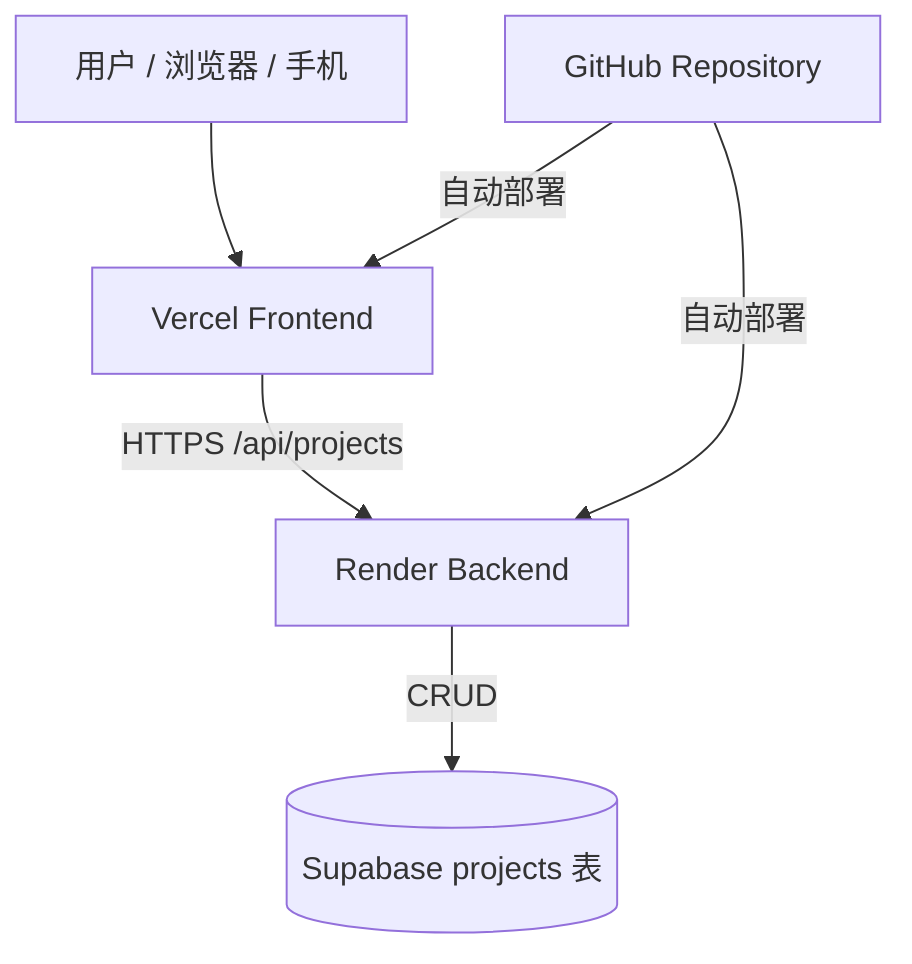
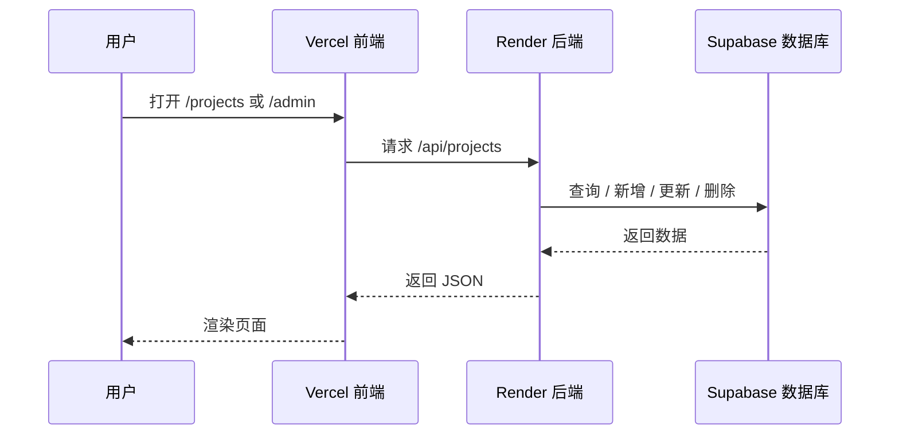

# MyBlogAboutWeb

一个已经完成线上部署的个人博客项目，展示机器人、视觉与嵌入式 AI 相关内容。

当前线上架构：

- 前端部署在 `Vercel`
- 后端部署在 `Render`
- 数据库存储在 `Supabase`

## 架构图



## 请求链路



## 项目说明

这个项目最初使用本地 `projects.json` 作为数据源，现已切换为 `Supabase` 数据库，支持线上读取、创建、编辑和删除项目内容。

页面包含：

- 首页
- 项目列表页
- 项目详情页
- 在线留言页（联系页）
- 后台登录页
- 后台管理页

## 项目结构

```text
ClaudeAboutWeb/
├── index.html
├── server.js
├── package.json
├── .env.example
├── vercel.json
├── data/
│   ├── projects.json
│   └── projects-import.csv
└── public/
    ├── index.html
    ├── projects.html
    ├── project-detail.html
    ├── contact.html
    └── admin.html
```

## 技术栈

- `Express`
- `Supabase`
- `Vercel`
- `Render`
- `HTML / CSS / JavaScript`

## 页面路由

- `/`：博客首页
- `/projects`：项目列表页
- `/project/:id`：项目详情页
- `/contact`：在线留言页（访客可直接给站长发消息）
- `/admin`：后台管理页
- `/admin-login`：后台登录页

`Vercel` 通过 [`vercel.json`](C:/Users/86151/Desktop/ClaudeCode/ClaudeAboutWeb/vercel.json) 将这些路由重写到静态页面：

- `/projects` -> `/projects.html`
- `/admin` -> `/admin.html`
- `/project/:id` -> `/project-detail.html?id=:id`

## API 端点

后端由 `Render` 托管，接口包括：

| 方法       | 路径                  | 功能             |
| ---------- | --------------------- | ---------------- |
| `GET`    | `/api/projects`     | 获取项目列表     |
| `GET`    | `/api/projects/:id` | 获取单个项目详情 |
| `POST`   | `/api/projects`     | 新建项目         |
| `PUT`    | `/api/projects/:id` | 更新项目         |
| `DELETE` | `/api/projects/:id` | 删除项目         |
| `POST`   | `/api/contact`      | 提交留言并邮件通知站长 |

## 在线留言（联系页）

访客在 `/contact` 页面填写称呼、邮箱（选填）和留言内容后，前端会调用 `POST /api/contact`，后端通过 SMTP 把留言邮件发送到 `CONTACT_TO`（默认 `2284610019@qq.com`）。

- 收件箱：由 `CONTACT_TO` 控制，默认即为 `2284610019@qq.com`
- 发件依赖 SMTP，需要配置 `SMTP_USER` 和 `SMTP_PASS`（QQ 邮箱使用「授权码」而非登录密码）
- 接口带有频率限制：同一 IP 每小时最多发送 5 条
- 若邮箱填写了，邮件会带上 `Reply-To`，方便直接回复
- 如果服务端尚未配置 SMTP，接口返回 503，前端会自动降级为 `mailto:` 链接，访客仍可一键用邮件联系

## CORS 跨域配置

前端（Vercel）与后端（Render）不同源，后端通过环境变量 `CORS_ORIGIN` 控制允许访问的前端域名。若页面出现 `Not allowed by CORS`，说明当前访问的域名不在白名单里。

- 多个域名用英文逗号隔开，**不要带结尾斜杠**（如 `https://xxx.vercel.app/` 会匹配失败）
- 匹配**忽略大小写并自动去掉结尾斜杠**，避免常见的格式踩坑
- 支持 `*` 通配符：配一条 `https://*.vercel.app` 即可同时覆盖正式域名和所有 Vercel **预览部署**域名（预览 URL 每个分支都不同）
- `CORS_ORIGIN` 留空表示放行所有来源（仅建议本地开发使用）

示例：

```env
CORS_ORIGIN=https://your-frontend-domain.vercel.app,https://*.vercel.app
```

## Supabase 数据表

项目数据存储在 `projects` 表中，推荐结构如下：

```sql
create table projects (
  id text primary key,
  title text not null,
  date date,
  summary text,
  "coverImage" text,
  "videoUrl" text,
  content text,
  created_at timestamp with time zone default now(),
  updated_at timestamp with time zone default now()
);
```

如果你的 `projects` 表是在加入视频功能之前创建的，请对线上数据库执行下面的迁移补上 `videoUrl` 列，否则项目列表、新增、编辑接口会返回 500：

```sql
alter table projects add column if not exists "videoUrl" text;
```

## 本地运行

### 1. 安装依赖

```bash
npm install
```

### 2. 配置环境变量

参考 [`.env.example`](C:/Users/86151/Desktop/ClaudeCode/ClaudeAboutWeb/.env.example)：

```env
SUPABASE_URL=https://your-project-ref.supabase.co
SUPABASE_SERVICE_ROLE_KEY=your-secret-key
CORS_ORIGIN=https://your-frontend-domain.vercel.app,https://*.vercel.app
ADMIN_USERNAME=admin
ADMIN_PASSWORD=change-this-password
ADMIN_SESSION_SECRET=change-this-random-secret
PORT=3000

# 在线留言邮件发送（联系页）
CONTACT_TO=2284610019@qq.com
SMTP_HOST=smtp.qq.com
SMTP_PORT=465
SMTP_SECURE=true
SMTP_USER=your-account@qq.com
SMTP_PASS=your-smtp-authorization-code
CONTACT_FROM=your-account@qq.com
```

### 3. 启动服务

```bash
node server.js
```

浏览器访问：

```text
http://localhost:3000
```

## 部署说明

### 前端部署到 Vercel

1. 将项目推送到 GitHub
2. 在 `Vercel` 中导入仓库
3. `Application Preset` 选择 `Other`
4. 部署完成后得到前端域名

### 后端部署到 Render

1. 在 `Render` 中创建 `Web Service`
2. 连接同一个 GitHub 仓库
3. 构建命令使用：

```bash
npm install
```

4. 启动命令使用：

```bash
node server.js
```

5. 在 `Environment Variables` 中添加：

```env
SUPABASE_URL=https://your-project-ref.supabase.co
SUPABASE_SERVICE_ROLE_KEY=your-secret-key
CORS_ORIGIN=https://your-frontend-domain.vercel.app,https://*.vercel.app
ADMIN_USERNAME=admin
ADMIN_PASSWORD=change-this-password
ADMIN_SESSION_SECRET=change-this-random-secret
NODE_ENV=production
CONTACT_TO=2284610019@qq.com
SMTP_HOST=smtp.qq.com
SMTP_PORT=465
SMTP_SECURE=true
SMTP_USER=your-account@qq.com
SMTP_PASS=your-smtp-authorization-code
CONTACT_FROM=your-account@qq.com
```

### 数据库部署到 Supabase

1. 创建 `Supabase` 项目
2. 新建 `projects` 表
3. 导入项目数据
4. 在 `Render` 中配置 `SUPABASE_URL` 和 `SUPABASE_SERVICE_ROLE_KEY`

## 当前说明

- 前端已经适配线上 `Render` API 地址
- 后端已经切换到 `Supabase`
- `projects.json` 现在主要作为初始数据参考，不再是线上正式数据源
- 已实际验证后台新增、编辑、删除可以写入 `Supabase`
- 后台新增了用户名密码登录保护，未登录不能执行创建、修改、删除操作
- 后台现在支持上传本地视频文件，视频会进入 `Supabase Storage`

## 后续可优化方向

- 为后台增加登录鉴权
- 给项目增加标签、分类和搜索
- 增加自定义域名
- 增加图片上传而不是只使用外链
